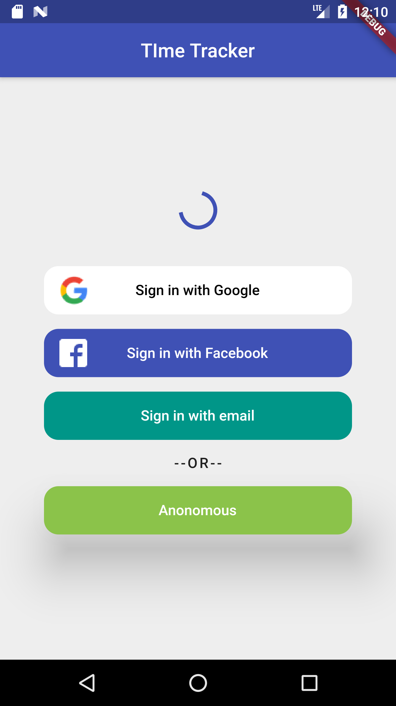
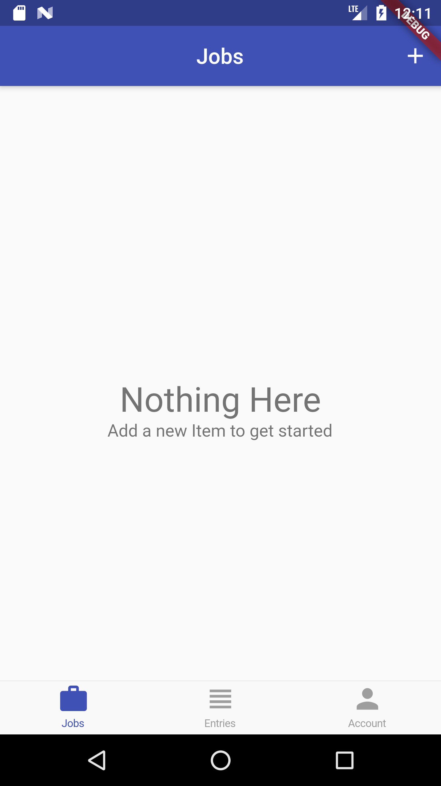
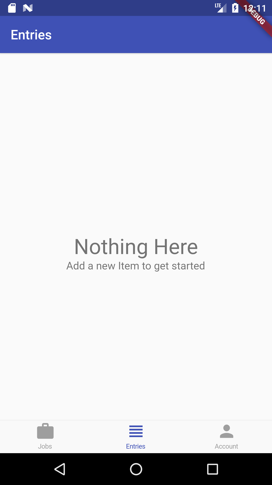
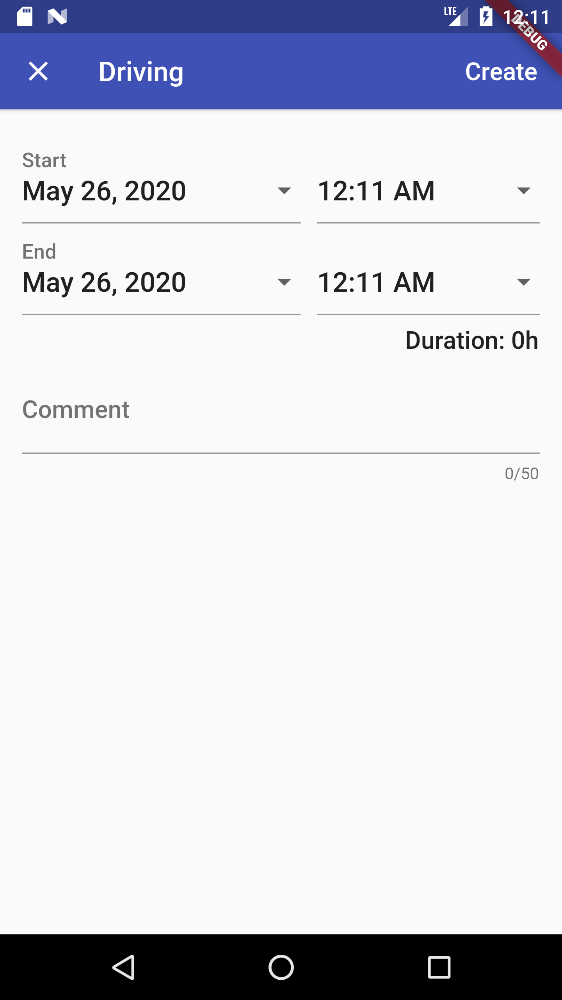
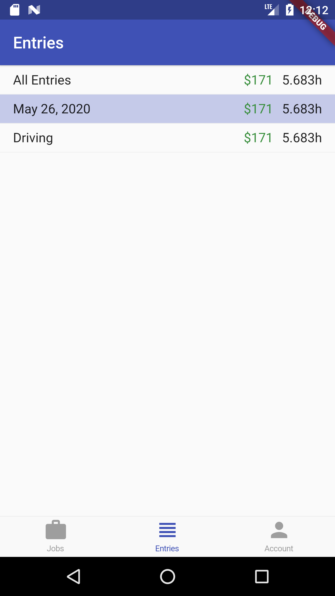
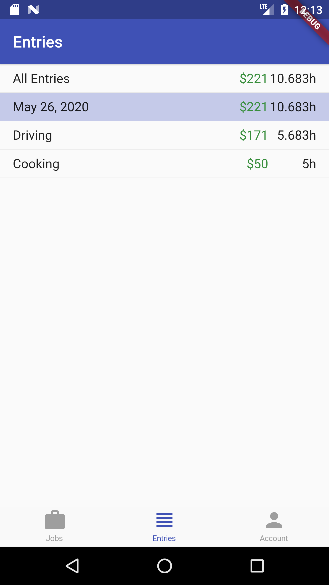
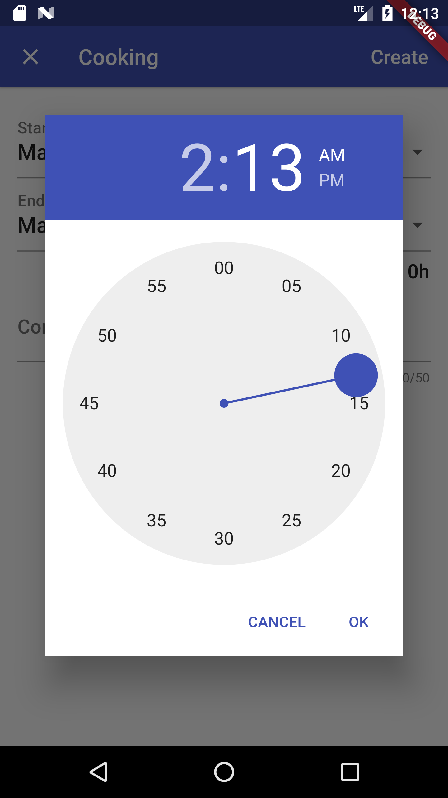
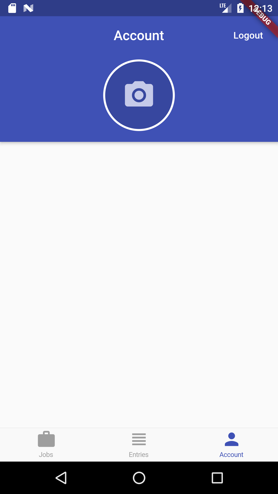

# time_tracker

A new Flutter project.
A simple tike tracking app for the different jos with respect to time and rate/hr. Just a schedule for the user to save their respective jobs.
### functionality
A project which include the most important OOPs concepts "Dependency Injection",
This project include introduction to different state management techniques such as  setState, BLoC and Provider.
Use of Stream, Stream Builders and Listener is also implementedand has a introduction to RXDART.
It has 4 ways of authtentication to go through the app Google signin, facebook signin, sign in with email and anonymously.
it usses the strorage from cloud firestore, configuring the small funtions such as circular progress indicator, customising the error messages, toggling between the forms, use of focus nodes

### A complete app based on google firebase.

||
||||
|||
## Getting Started

This project is a starting point for a Flutter application.

A few resources to get you started if this is your first Flutter project:

- [Lab: Write your first Flutter app](https://flutter.dev/docs/get-started/codelab)
- [Cookbook: Useful Flutter samples](https://flutter.dev/docs/cookbook)

For help getting started with Flutter, view our
[online documentation](https://flutter.dev/docs), which offers tutorials,
samples, guidance on mobile development, and a full API reference.
